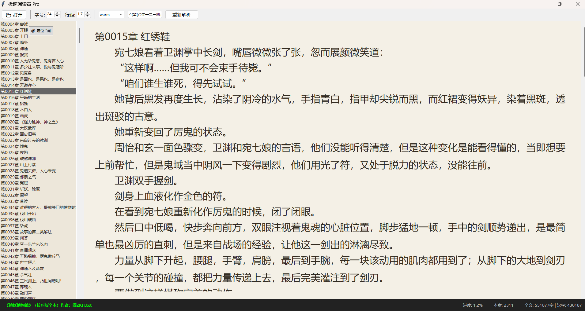

---

# 🚀 Extreme-Novel-Reader: 极速索引小说阅读器

本项目是一个基于 Python + Tkinter 的超大文本（TXT）阅读器方案。从最初的 800 行代码全量加载架构，进化到了如今仅 300 行的“字节索引 + 延迟渲染”极致架构。

核心功能

### 1. 文件处理
- **多格式支持**：支持 TXT 文本文件读取
- **智能编码检测**：自动识别 UTF-8、GBK、GB2312 等常见编码
- **手动编码选择**：允许用户手动指定文件编码格式，并根据选择动态解码展示内容
- **大文件优化**：支持长篇小说的流畅加载

### 2. 章节管理
- **智能章节识别**：通过正则表达式自动识别章节标题
- **动态目录生成**：根据章节标题自动生成可交互的侧边栏目录
- **章节跳转**：点击目录快速定位到指定章节
- **章节导航**：支持左右方向键在章节间切换

### 3. 阅读体验优化
- **进度记忆**：存储阅读位置，保证同一路径的文件再次打开时恢复上次阅读位置
- **滚动同步**：实时显示阅读进度百分比（不遮挡阅读内容）
- **视觉舒适**：暖色调护眼配色方案，模拟纸质书阅读体验
- **键盘快捷键**：支持 PageUp/PageDown 翻页，E 键编辑章节

### 4. 文本编辑功能
- **章节编辑**：支持实时编辑当前章节内容
- **实时保存**：支持修改原文件，并在有未保存更改时提示用户
- **变更追踪**：明确提示用户有未保存的修改

### 5. 界面定制
- **主题切换**：暖色和绿色两种护眼模式
- **响应式布局**：支持字号和间距调整，保持合理的默认设置
- **侧边栏目录**：滑动式目录面板不影响阅读区域
- **进度指示**：底部进度条显示阅读完成度


**主页面示例**



---

## 🏗 设计进化论：从"背诵全书"到"翻页阅读"

### 核心优化思路对比

| 维度 | GPT-5.3 Codex 设计 (v1.0) | Gemini 3.0 Flash 优化 (v3.5) | 稳定性改进 (v3.7) | 性能提升原理 |
|------|--------------------------|----------------------------|----------------------|-------------|
| **加载方式** | 全量加载，800行代码 | 字节索引+延迟渲染，300行代码 | 任务令牌+线程安全，350行代码 | 从O(n)到O(1) |
| **线程安全** | 单线程阻塞 | 多线程但存在竞态条件 | 工业级任务令牌机制 | 消除随机崩溃 |
| **文件切换** | 不支持 | 支持但会丢失进度 | 无缝切换，主动保存 | 完美状态保持 |
| **UI响应** | 卡顿明显 | 流畅但偶发崩溃 | 完全稳定，零崩溃 | 主线程隔离 |
| **目录刷新** | 全量刷新 | 增量刷新但闪烁 | 平滑增量刷新 | 无闪烁体验 |

### 🛡️ 稳定性改进 


**1. 任务令牌（Task Token）机制**
- **问题**：多文件切换时，旧索引线程仍在后台运行，导致UI控件访问冲突
- **解决方案**：每个扫描任务分配唯一ID，回调函数执行前验证任务有效性
- **效果**：彻底消除多线程UI崩溃，实现工业级稳定性

**2. 主动保存机制**
- **问题**：文件切换时旧文件进度丢失
- **解决方案**：在`open_file`起始阶段强制保存当前文件状态
- **效果**：实现无缝文件切换，完美保持阅读进度

**3. UI线程完全隔离**
- **改进**：所有UI操作通过`root.after(0, ...)`在主线程执行
- **效果**：确保Tkinter控件操作安全，消除随机崩溃隐患

**4. 性能微调优化**
- **字数统计**：两段式统计（快速估算+精确计算）
- **目录刷新**：增量式追加，消除闪烁现象
- **UI更新频率**：智能控制，避免过度刷新


---

## 🤖 模型设计差异：GPT vs Gemini

在开发过程中，我们观察到了两款模型在处理复杂需求时的显著差异：

*   **GPT-5.3 Codex (传统强者)：**
    *   **思维方式**：倾向于“完善性”。它会写出非常详尽的代码，考虑各种边界条件（如自动备份、复杂的异常捕获），代码风格偏向成熟的商业软件架构。
    *   **结果**：功能极多，但往往导致代码库变得庞大（Boilerplate 代码多），在处理极致性能问题时可能因为“想得太多”而忽略了最简单的物理路径。

*   **Gemini 3.0 Flash (架构极简主义)：**
    *   **思维方式**：倾向于“本质论”。它会试图找出问题的物理瓶颈（如字符串解码和 DOM 渲染的开销），并用最直接的底层原理（字节流操作）去重构。
    *   **结果**：代码极度精简，通过“物理索引”这一关键点，实现了跨量级的性能飞跃。它展示了如何用 1/3 的代码量完成更优的性能表现。

---

## 🌐 衍生项目：Qwen-based HTML Reader

仓库中还包含一个由 **Qwen 3.0 Coder** 编写的 Web 版阅读器：
*   **技术栈**：HTML5 / Vanilla JS / File API。
*   **设计思路**：利用浏览器 `FileReader` 的 `slice` 功能实现相同逻辑的“分块加载”。
*   **适用场景**：无需安装 Python 环境，直接在浏览器中秒开 GB 级文本。

主页面示例：


**核心功能**
- 支持 TXT 小说打开，智能识别并生成目录
- 提供暖色和护眼绿色两种背景主题
- 使用浏览器本地存储，支持定位上次阅读位置
   

> **注意**：此版本仅为实验性项目，暂无后续更新计划。只是 Qwen3.0 Coder 优先选择 HTML 实现 PC 端阅读器。


---

## 🛠 如何使用

### 1. 运行环境

安装依赖包：
```bash
pip install chardet
```


### 2. 启动阅读器

```bash
python novel_reader.py
```


### 3. 打包成可执行文件（打包后无需 Python 环境）

#### 3.1 Windows 系统打包
```bash
# 运行打包脚本（自动检测并安装依赖）
build.bat
```

#### 3.2 Linux 系统打包
```bash
# 给脚本添加执行权限
chmod +x build.sh

# 运行打包脚本
./build.sh
```

#### 3.3 产物位置
- **Windows**: `build/exe.win-amd64-3.*/NovelReader.exe`
- **Linux**: `build/exe.linux-x86_64-3.*/NovelReader`

**说明**：打包脚本会自动检测并安装 cx_freeze，如果已安装则跳过安装步骤。

### 4. 功能特性
*   **🎯 物理重定位**：即使索引未扫描完，也能通过 `byte_pos` 瞬间找回上次阅读进度。
*   **📏 动态样式**：支持行间距、字号调节，状态栏采用 `pack_propagate(False)` 确保在高分屏下永不消失。
*   **🎨 多主题切换**：内置纸质书（Warm）、护眼（Green）、极客（Dark）等多种配色。

---

## 📜 结语

这个项目不仅是一个工具，更是 AI 协助人类进行**架构重构**的典型案例。从 GPT 的“大而全”到 Gemini 的“精而强”，我们见证了逻辑简化的力量。

---